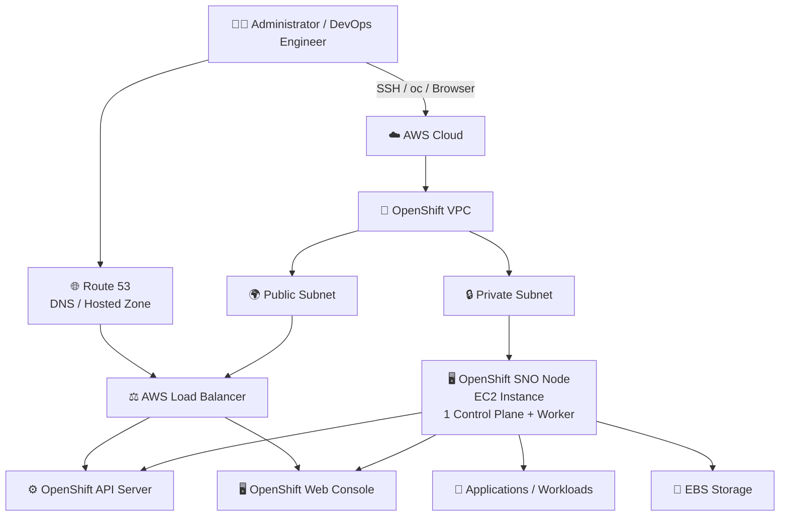
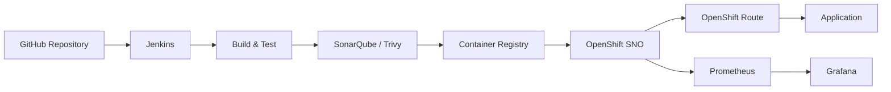

# IPI Installation 
# OpenShift Single Node OpenShift (SNO) on AWS

Deploy a **Single Node OpenShift (SNO)** cluster on Amazon Web Services (AWS) using the official OpenShift Installer.

This repository provides a practical, step-by-step guide for creating an OpenShift SNO environment on AWS for **learning, DevOps training, Kubernetes/OpenShift labs, CI/CD practice, and testing**.

> **Important:** SNO is intended primarily for development, lab, testing, and learning environments. It is not a replacement for a highly available production OpenShift cluster.

---

## 📌 Architecture



### High-Level Flow

```text
Developer
    │
    ├── SSH
    ├── oc CLI
    └── Web Browser
          │
          ▼
       Route 53
          │
          ▼
   AWS Load Balancer
          │
          ▼
 ┌─────────────────────┐
 │ OpenShift SNO Node  │
 │                     │
 │ Control Plane       │
 │ +                   │
 │ Worker              │
 │                     │
 │ API Server          │
 │ Scheduler           │
 │ Controller Manager  │
 │ etcd                │
 │ Kubelet             │
 │ OpenShift Console   │
 └─────────────────────┘
          │
          ▼
    Applications
```

---

# 📋 Table of Contents

* [What is SNO?](#-what-is-sno)
* [Architecture](#-architecture)
* [Prerequisites](#-prerequisites)
* [Step 1 - Prepare AWS Account](#step-1---prepare-aws-account)
* [Step 2 - Configure Domain](#step-2---configure-domain)
* [Step 3 - Download OpenShift Tools](#step-3---download-openshift-tools)
* [Step 4 - Generate SSH Key](#step-4---generate-ssh-key)
* [Step 5 - Configure AWS CLI](#step-5---configure-aws-cli)
* [Step 6 - Create install-config.yaml](#step-6---create-install-configyaml)
* [Step 7 - Generate Manifests](#step-7---generate-manifests)
* [Step 8 - Enable Control Plane Scheduling](#step-8---enable-control-plane-scheduling)
* [Step 9 - Generate Ignition Configs](#step-9---generate-ignition-configs)
* [Step 10 - Create the OpenShift Cluster](#step-10---create-the-openshift-cluster)
* [Step 11 - Verify the Cluster](#step-11---verify-the-cluster)
* [Step 12 - Access OpenShift Console](#step-12---access-openshift-console)
* [Troubleshooting](#-troubleshooting)
* [Cost Considerations](#-cost-considerations)
* [Destroy the Cluster](#-destroy-the-cluster)
* [Useful Commands](#-useful-commands)
* [Project Structure](#-project-structure)
* [Learning Ideas](#-learning-ideas)
* [Disclaimer](#-disclaimer)

---

# 🚀 What is SNO?

**Single Node OpenShift (SNO)** is an OpenShift deployment where a single machine performs both:

* Control Plane responsibilities
* Worker responsibilities

Instead of running separate control-plane and worker nodes, SNO combines them into one node.

### Traditional OpenShift Cluster

```text
              OpenShift Cluster
                     │
       ┌─────────────┴─────────────┐
       │                           │
 Control Plane                  Workers
       │                           │
 ┌─────┼─────┐              ┌──────┼──────┐
 │     │     │              │      │      │
Master Master Master       Worker Worker Worker
```

### SNO Cluster

```text
          OpenShift SNO
               │
        ┌──────┴──────┐
        │             │
   Control Plane    Worker
        │             │
        └──────┬──────┘
               │
         Single EC2 Node
```

This makes SNO extremely useful for **training and lab environments** where running multiple OpenShift nodes would be unnecessarily expensive.

---

# 🧰 Prerequisites

Before starting, make sure you have the following.

## 1. AWS Account

Your AWS account should have sufficient permissions to create resources such as:

* EC2
* VPC
* Subnets
* Security Groups
* IAM-related resources
* Elastic Load Balancers
* EBS volumes
* Route 53 resources

> The exact permissions depend on the OpenShift installation method and AWS environment.

---

## 2. Domain Name

You need a domain or subdomain that can be managed through Route 53.

Example:

```text
example.com
```

or:

```text
aws.example.com
```

The OpenShift installer will create DNS records required by the cluster.

---

## 3. Red Hat Pull Secret

Download your OpenShift pull secret from:

**Red Hat Hybrid Cloud Console**

https://console.redhat.com/openshift/install/pull-secret

A Red Hat account is required.

The pull secret is used by OpenShift to authenticate against Red Hat registries and download required OpenShift images.

---

## 4. Linux Workstation / Server

Recommended:

```text
Operating System: RHEL / Rocky Linux / AlmaLinux / Ubuntu
Architecture: x86_64
Internet: Required
AWS CLI: Required
```

Make sure the machine has enough disk space for OpenShift installer files and generated configuration.

---

# Step 1 - Prepare AWS Account

Configure your AWS credentials.

```bash
aws configure
```

Example:

```text
AWS Access Key ID:     YOUR_ACCESS_KEY
AWS Secret Access Key: YOUR_SECRET_KEY
Default region name:   ap-south-1
Default output format: json
```

Verify:

```bash
aws sts get-caller-identity
```

You should receive your AWS account and IAM identity information.

---

# Step 2 - Configure Domain

Create or use a Route 53 hosted zone for your domain.

Example:

```text
example.com
```

Your OpenShift cluster may then use DNS names similar to:

```text
api.sno-test.example.com

api-int.sno-test.example.com

*.apps.sno-test.example.com
```

The OpenShift installer manages the required DNS records when the AWS platform configuration is used.

---

# Step 3 - Download OpenShift Tools

Check the latest stable OpenShift release:

```bash
curl -s https://mirror.openshift.com/pub/openshift-v4/clients/ocp/latest/release.txt
```

Download the OpenShift installer:

```bash
wget https://mirror.openshift.com/pub/openshift-v4/clients/ocp/stable/openshift-install-linux.tar.gz
```

Extract:

```bash
tar -xvf openshift-install-linux.tar.gz
```

Download the OpenShift client:

```bash
wget https://mirror.openshift.com/pub/openshift-v4/clients/ocp/stable/openshift-client-linux.tar.gz
```

Extract:

```bash
tar -xvf openshift-client-linux.tar.gz
```

Install the binaries:

```bash
sudo mv openshift-install oc /usr/local/bin/
```

Verify:

```bash
openshift-install version
```

and:

```bash
oc version
```

---

# Step 4 - Generate SSH Key

Generate an SSH key specifically for the SNO cluster:

```bash
ssh-keygen -t ed25519 -N '' -f ~/.ssh/sno-key
```

Verify:

```bash
ls -l ~/.ssh/sno-key*
```

You should have:

```text
~/.ssh/sno-key
~/.ssh/sno-key.pub
```

The public key will be supplied to the OpenShift installer.

---

# Step 5 - Create the OpenShift Installation Directory

Create a dedicated directory:

```bash
mkdir sno-cluster
cd sno-cluster
```

---
# Important step for route 53 we have already created a one hosted zone openshift create new hosted zone and now openshift hosted attach with routing poilicy and record 

Route 53 → Hosted zones → grras.xyz → Create record

par ho.

1. Record name
openshift

2. Record type

Dropdown mein:

NS - Routes traffic to name servers for a hosted zone (select karo)

3. Value

Tumhari screenshot mein child hosted zone ke 4 nameservers hain:

ns-1536.awsdns-00.co.uk
ns-0.awsdns-00.com
ns-1024.awsdns-00.org
ns-512.awsdns-00.net

Inko exactly 4 separate lines mein rakho:

ns-1536.awsdns-00.co.uk
ns-0.awsdns-00.com
ns-1024.awsdns-00.org
ns-512.awsdns-00.net
4. TTL
300

5. Routing policy
Simple routing

# Step 6 - Create install-config.yaml

Run:

```bash
openshift-install create install-config --dir=.
```

The installer will ask several questions.

Typical values:

```text
SSH Public Key:
~/.ssh/sno-key.pub

Platform:
aws

Region:
ap-south-1

Base Domain:
example.com

Cluster Name:
sno-test

Pull Secret:
<Paste Red Hat Pull Secret>
```

The installer will create:

```text
install-config.yaml
```

---

# ⚙️ Configure SNO

Open the configuration:

```bash
vi install-config.yaml
```

Configure the control plane and compute replicas for SNO:

```yaml
controlPlane:
  hyperthreading: Enabled
  name: master
  replicas: 1

compute:
- hyperthreading: Enabled
  name: worker
  replicas: 0

platform:
  aws:
    region: ap-south-1
    type: m6i.4xlarge
```

### Important

SNO requires:

```yaml
controlPlane:
  replicas: 1

compute:
- replicas: 0
```

The single control-plane node also runs workloads.

---

# 💾 Backup install-config.yaml

The installer consumes `install-config.yaml` during later installation steps.

Create a backup:

```bash
cp install-config.yaml install-config.yaml.bak
```

It is strongly recommended to keep this backup outside the generated installation directory as well.

Example:

```bash
cp install-config.yaml ~/sno-install-config.yaml.backup
```

---

# Step 7 - Generate Manifests

Generate OpenShift manifests:

```bash
openshift-install create manifests --dir=.
```

This creates directories such as:

```text
manifests/
openshift/
```

You can inspect the generated files:

```bash
ls -la
```

---

# Step 8 - Enable Control Plane Scheduling

Because this is SNO, workloads need to be allowed to run on the control-plane node.

Check:

```text
manifests/cluster-scheduler-02-config.yml
```

Make sure the scheduler configuration contains:

```yaml
mastersSchedulable: true
```

Example:

```yaml
apiVersion: config.openshift.io/v1
kind: Scheduler
metadata:
  name: cluster
spec:
  mastersSchedulable: true
```

This allows the SNO node to run both infrastructure and application workloads.

---

# Step 9 - Generate Ignition Configs

Generate the ignition configuration:

```bash
openshift-install create ignition-configs --dir=.
```

You should now see files similar to:

```text
bootstrap.ign
master.ign
worker.ign
metadata.json
```

---

# Step 10 - Create the OpenShift Cluster

Start the installation:

```bash
openshift-install create cluster --dir=. --log-level=info
```

The installer will provision the required AWS infrastructure.

Depending on the configuration, this can include:

```text
AWS VPC
    │
    ├── Subnets
    ├── Route Tables
    ├── Security Groups
    ├── EC2 Instance
    ├── Load Balancers
    └── EBS Storage
```

The installer will then bootstrap OpenShift on the EC2 infrastructure.

Typical installation time can be approximately:

```text
40 - 60+ minutes
```

Actual installation time depends on AWS region, network performance, AWS capacity, and OpenShift release.

---

# Step 11 - Verify the Cluster

After installation completes, configure your kubeconfig:

```bash
export KUBECONFIG=$(pwd)/auth/kubeconfig
```

Verify nodes:

```bash
oc get nodes
```

Expected result should contain one node similar to:

```text
NAME                  STATUS   ROLES                         AGE
ip-10-0-x-x...        Ready    control-plane,master,worker   ...
```

Check cluster operators:

```bash
oc get clusteroperators
```

Check all pods:

```bash
oc get pods -A
```

Check cluster version:

```bash
oc get clusterversion
```

Check cluster status:

```bash
openshift-install wait-for install-complete \
  --dir=. \
  --log-level=info
```

---

# Step 12 - Access OpenShift Console

Get the kubeadmin password:

```bash
cat auth/kubeadmin-password
```

The installer output will provide the OpenShift Console URL.

It will look similar to:

```text
https://console-openshift-console.apps.sno-test.example.com
```

Open the URL in your browser.

Login:

```text
Username:
kubeadmin

Password:
<output from auth/kubeadmin-password>
```

---

# 🔍 Useful Verification Commands

## Check Nodes

```bash
oc get nodes
```

---

## Check Node Details

```bash
oc describe node
```

---

## Check Cluster Operators

```bash
oc get clusteroperators
```

---

## Check Pods Across All Namespaces

```bash
oc get pods -A
```

---

## Check Projects

```bash
oc get projects
```

---

## Check Routes

```bash
oc get routes -A
```

---

## Check Services

```bash
oc get svc -A
```

---

## Check OpenShift Version

```bash
oc version
```

---

## Check Cluster Version

```bash
oc get clusterversion
```

---

# 🧪 Test Application Deployment

Once the SNO cluster is ready, deploy a simple application.

Create an NGINX deployment:

```bash
oc create deployment nginx --image=nginx
```

Check the pod:

```bash
oc get pods
```

Expose it:

```bash
oc expose deployment nginx --port=80
```

Create a Route:

```bash
oc expose service nginx
```

Get the route:

```bash
oc get route nginx
```

You can then access the application using the generated URL.

---

# 🛠️ Troubleshooting

## Problem: `oc: command not found`

Check:

```bash
which oc
```

If it is missing:

```bash
sudo mv oc /usr/local/bin/
```

Then:

```bash
oc version
```

---

## Problem: `openshift-install: command not found`

Check:

```bash
which openshift-install
```

Install it:

```bash
sudo mv openshift-install /usr/local/bin/
```

Verify:

```bash
openshift-install version
```

---

## Problem: AWS credentials not working

Run:

```bash
aws sts get-caller-identity
```

If this fails, verify:

```bash
aws configure
```

Also verify that the IAM identity has sufficient permissions.

---

## Problem: DNS issues

Verify your Route 53 hosted zone and domain delegation.

Check DNS:

```bash
dig api.sno-test.example.com
```

or:

```bash
nslookup api.sno-test.example.com
```

---

## Problem: Installation gets stuck

Check the installation log:

```bash
openshift-install create cluster \
  --dir=. \
  --log-level=debug
```

You can also inspect the installer log generated in the installation directory.

---

## Problem: Node is not Ready

Run:

```bash
oc get nodes
```

Then:

```bash
oc describe node <node-name>
```

Check cluster operators:

```bash
oc get clusteroperators
```

And:

```bash
oc get pods -A
```

Look for pods in:

```text
CrashLoopBackOff
Pending
ImagePullBackOff
Error
```

---

# 💰 Cost Considerations

AWS OpenShift SNO can become expensive quickly.

The total cost can include:

```text
EC2
+
EBS
+
Load Balancers
+
Elastic IP / Networking
+
Data Transfer
+
Other AWS Resources
```

The selected EC2 instance is one of the major cost components.

For example:

```yaml
type: m6i.4xlarge
```

is a relatively large instance and should be used carefully for a learning environment.

> **Always check current AWS pricing for your region before deployment.**

For training labs, start the environment only when required and destroy it when the lab is finished.

---

# 🧹 Destroy the Cluster

When your training or testing is complete:

```bash
openshift-install destroy cluster --dir=.
```

Confirm that AWS resources have been removed.

You can also verify from AWS CLI:

```bash
aws ec2 describe-instances
```

and check:

```text
EC2
VPC
Load Balancers
EBS
Route 53
Security Groups
```

> Do not assume that every manually created AWS resource will automatically be removed. Always verify your AWS account after destroying the cluster.

---

# 📁 Recommended Project Structure

A clean repository can look like:

```text
openshift-sno-aws/
│
├── README.md
│
├── docs/
│   ├── architecture.md
│   ├── troubleshooting.md
│   └── commands.md
│
├── examples/
│   └── nginx/
│       ├── deployment.yaml
│       └── service.yaml
│
└── screenshots/
    ├── aws-console.png
    ├── openshift-console.png
    └── oc-get-nodes.png
```

> **Never commit your real `install-config.yaml`, pull secret, kubeconfig, or private SSH key to GitHub.**

Add sensitive files to `.gitignore`:

```gitignore
install-config.yaml
install-config.yaml.bak
auth/
metadata.json
*.ign
.openshift_install_state.json
.openshift_install.log
*.pem
*.key
id_rsa
sno-key
sno-key.pub
```

---

# 🔐 Security Best Practices

Never upload these files to a public GitHub repository:

```text
❌ Pull Secret
❌ AWS Access Keys
❌ AWS Secret Keys
❌ kubeadmin-password
❌ kubeconfig
❌ SSH Private Key
❌ AWS private certificates
```

Use environment variables, AWS IAM roles, GitHub Secrets, or another secure secret-management mechanism.

---

# 🎓 Learning Roadmap

After successfully creating the SNO cluster, you can use it to practice:

### OpenShift Fundamentals

```text
Projects
Namespaces
Pods
Deployments
ReplicaSets
Services
Routes
ConfigMaps
Secrets
```

### OpenShift Administration

```text
RBAC
Users
Groups
Security Context Constraints
Resource Quotas
LimitRanges
Operators
ClusterOperators
Node Management
Machine Config
```

### Storage

```text
PV
PVC
StorageClasses
CSI
Dynamic Provisioning
EBS
```

### Networking

```text
Services
Routes
Ingress
NetworkPolicies
OpenShift SDN / OVN-Kubernetes
Load Balancers
DNS
```

### CI/CD

```text
Jenkins
GitHub Actions
Tekton
OpenShift Pipelines
Argo CD
GitOps
```

### Monitoring

```text
Prometheus
Grafana
Alertmanager
OpenShift Monitoring
Cluster Metrics
Application Metrics
```

---

# 🚀 Suggested DevOps Lab Flow

After the cluster is ready, a complete learning project can follow this architecture:



This gives you a complete practical environment for learning:

```text
Git
 ↓
Jenkins
 ↓
Build
 ↓
SonarQube
 ↓
Trivy
 ↓
Container Registry
 ↓
OpenShift
 ↓
Route
 ↓
Application
 ↓
Prometheus
 ↓
Grafana
```

---

# 📚 Useful OpenShift Commands Cheat Sheet

```bash
# Login
oc login

# Cluster information
oc cluster-info

# Nodes
oc get nodes

# Pods
oc get pods -A

# Projects
oc get projects

# Create project
oc new-project demo

# Deploy application
oc new-app nginx

# Services
oc get svc

# Routes
oc get routes

# Expose service
oc expose svc/nginx

# Deployment
oc get deployment

# Scale deployment
oc scale deployment nginx --replicas=3

# Application logs
oc logs deployment/nginx

# Describe resource
oc describe pod <pod-name>

# Delete resource
oc delete pod <pod-name>
```

---

# ⚠️ Important Notes

1. OpenShift release versions change over time. Always verify the supported version and installation documentation before deploying.
2. AWS pricing changes by region and over time.
3. The example region used in this guide is:

```text
ap-south-1
```

Change it according to your AWS environment.

4. The example instance type is:

```text
m6i.4xlarge
```

Choose an instance size compatible with the OpenShift version and SNO requirements you are deploying.

5. Do not expose OpenShift administrative interfaces unnecessarily to the public internet.
6. Keep your Red Hat pull secret private.
7. Never commit credentials or private keys to GitHub.
8. Destroy the environment after completing temporary labs to avoid unnecessary AWS charges.

---

# 📖 Official Documentation

* Red Hat OpenShift Documentation
* Red Hat Hybrid Cloud Console
* AWS Documentation
* OpenShift Installer Documentation
* OpenShift CLI (`oc`) Documentation

---

# 🤝 Contributing

Contributions are welcome.

If you find an issue:

1. Fork the repository.
2. Create a feature branch.
3. Make your changes.
4. Test the instructions.
5. Submit a Pull Request.

Example:

```bash
git clone <your-repository-url>

cd openshift-sno-aws

git checkout -b feature/update-documentation
```

---

# 📜 Disclaimer

This project is provided for **educational, development, and testing purposes**.

Always verify current OpenShift and AWS documentation before deploying infrastructure in a production environment.

The author is not responsible for AWS charges, infrastructure failures, data loss, or configuration issues resulting from using this guide.

---

# ⭐ If This Guide Helped You

If this repository helped you learn OpenShift on AWS:

**⭐ Star the repository**

**🍴 Fork the repository**

**🐛 Open an issue for problems**

**🤝 Submit improvements through Pull Requests**

---

## Happy Learning 🚀

```text
                    ☁️ AWS
                     │
                     ▼
              ┌──────────────┐
              │ OpenShift SNO│
              └──────┬───────┘
                     │
          ┌──────────┼──────────┐
          ▼          ▼          ▼
        Apps       CI/CD     Monitoring
          │          │          │
          ▼          ▼          ▼
       OpenShift   Jenkins   Prometheus
         Route                 │
                               ▼
                             Grafana
```

**Build it. Break it. Fix it. Learn OpenShift. 🚀**
